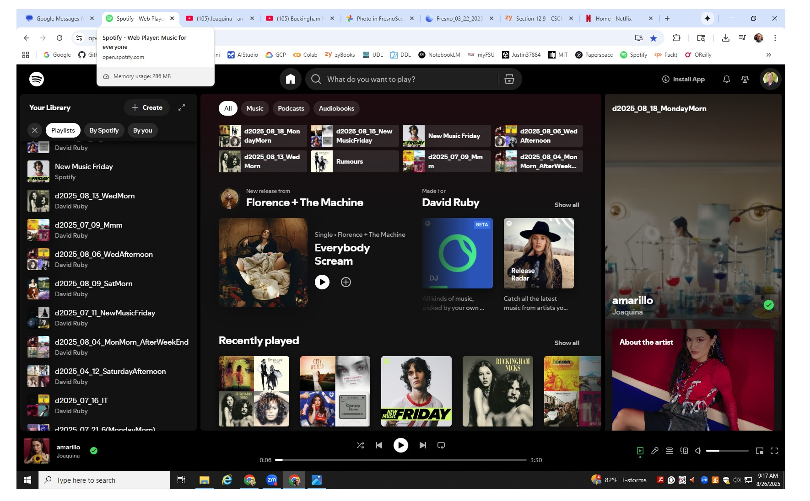
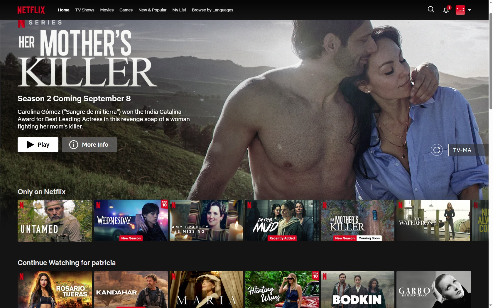
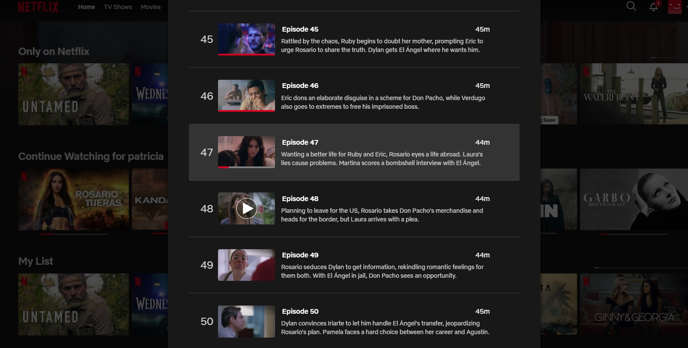
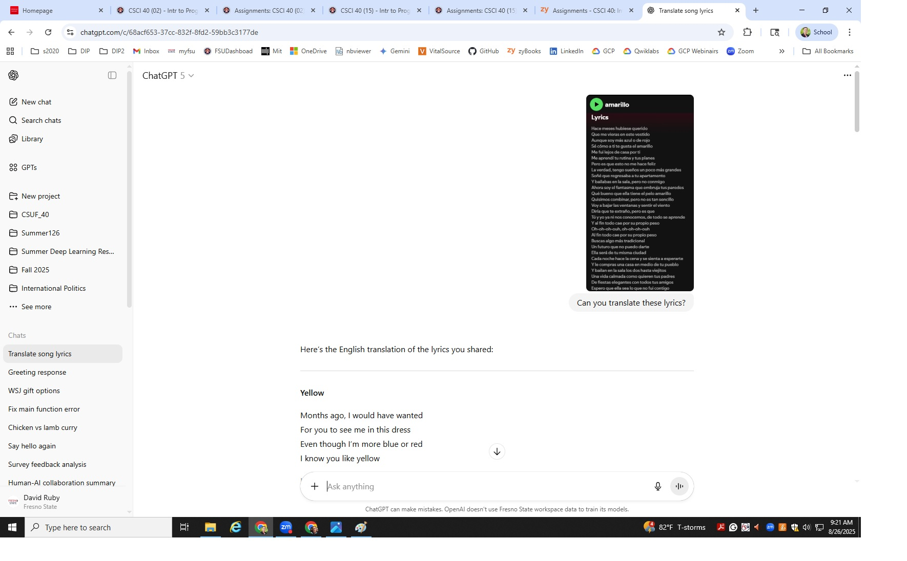
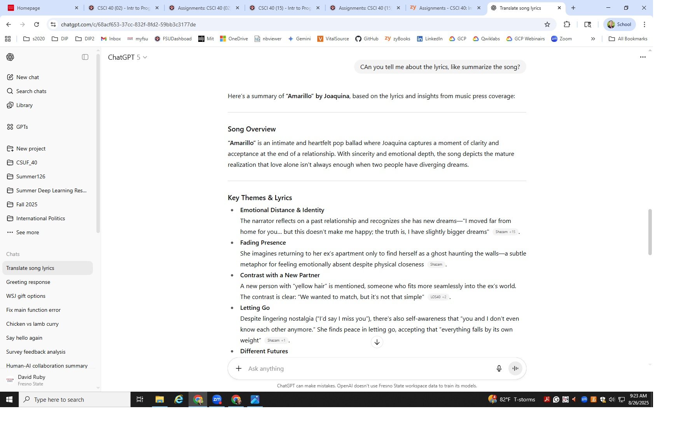

# Using Data to Drive Action

## 1. Context

+ Mornign Music in car w/ Spotify
+ Evening Viewing w/ Netflix
  
---

## 2. Data Sources

  
    
  

+ Spotify: New Music Friday
+ Netflix: New On Netflix / Only on Netflix

---

## 3. Data Preparation

## 4. Data Exploration
Before drawing conclusions, I explored the data to understand its scope and patterns:  

**Netflix**

  
   

**Spotify**

  
    
  

